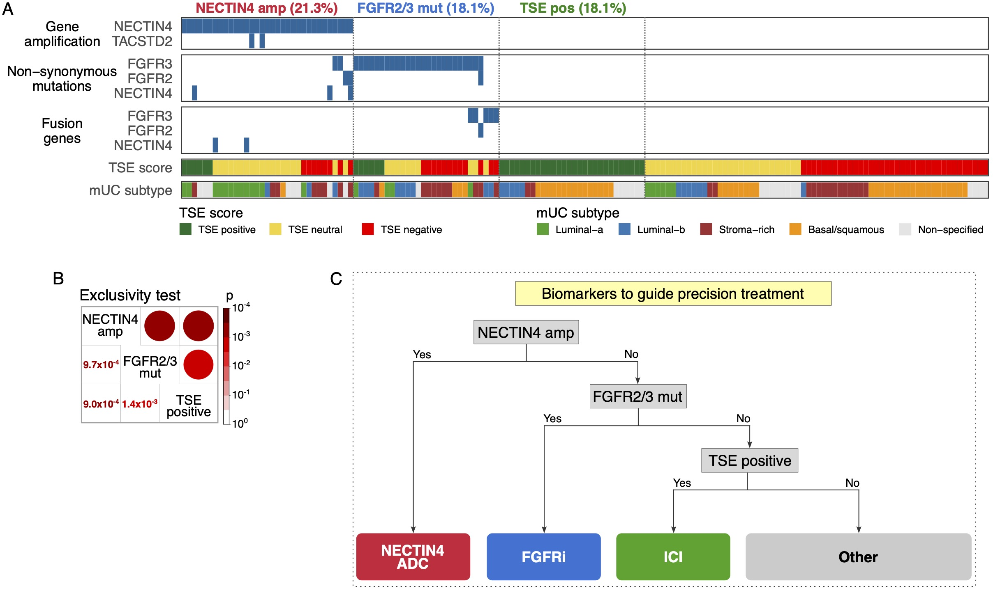

# Molecular biomarkers to guide treatment-decision making in metastatic urothelial cancer

## Description

Recent approvals of immune check-point inhibitors (ICI), enfortumab vedotin (EV; nectin-4-directed antibody and microtubule inhibitor conjugate) combined with ICI, and the fibroblast growth factor receptors (FGFR) inhibitor erdafitinib are anticipated to change the therapeutic landscape for metastatic Urothelial Carcinoma (mUC) patients. Using whole-genome DNA- and paired RNA-sequencing data of metastatic tumor biopsies of 155 mUC patients, we stratified patients based on known treatment response predictive markers. The study reported by Robbrechta, et al., entitled [Novel molecular biomarkers to guide treatment-decision making in metastatic urothelial cancer - A patient cohort analysis](https://euoncology.europeanurology.com/ "Biomarkers to guide treatment-decision in metastatic urothelial cancer") is currently under review.

We observed that NECTIN4 amplification, FGFR2/3 mutations/fusions, and the RNA-expression-based T-Cell-to-Stroma Enrichment (TSE) score were mutually exclusive, and may therefore reflect biologically distinct tumors and sensitivity to treatments. This finding was validated in two independent bladder cohorts, suggesting that stratification of patients for therapy selection based on these molecular features is possible.

## Code for patient stratification

The script used for this study is in the `R` folder. The `biomarkers_mUC_DR314.R` reproduces the main Figures of this study and requires the user to provide somatic mutations (including structural variants), fusion genes, copy number calls (GISTIC), and raw mRNA counts.

Genomic and transcriptomic data used in this study is access controlled and must be requested to the HMF under the request number DR-314. WGS data, RNA-seq data and corresponding clinical data are freely available for academic use and request forms can be found at <https://www.hartwigmedicalfoundation.nl/en/data/data-access-request/>.

## Reference

Robbrecht DGJ, Salhi Y, Martens JWM, Aarts MJB, Hamberg P, van der Heijden MS, Voortman J, Mehra N, Westgeest HM, de Wit R, Debets R, Boormans JL, Nakauma-González JA. Novel molecular biomarkers to guide treatment-decision making in metastatic urothelial cancer - A patient cohort analysis. *Under Review* **XX**, YYYY (2025). <https://euoncology.europeanurology.com/>